# Heritage Housing Sale Price Predictor

The heritage housing sale price predictor is an app to predict the sale price of houses in Ames, Iowa.
Further to this to app aims to predict the sale price of the four homes the client has inherited in Ames, Iowa

Visit the deployed site here: [Heritage Housing](https://heritage-housing-739de1000c22.herokuapp.com/)

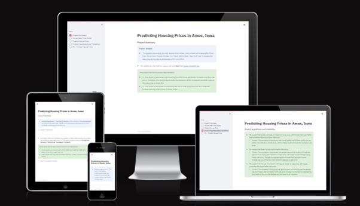

## Contents

- [Heritage Housing](#heritage-housing)

## Dataset Content  
* The dataset is sourced from [Kaggle](https://www.kaggle.com/codeinstitute/housing-prices-data). We then created a fictitious user story where predictive analytics can be applied in a real project in the workplace. 
* The dataset has almost 1.5 thousand rows and represents housing records from Ames, Iowa, indicating house profile (Floor Area, Basement, Garage, Kitchen, Lot, Porch, Wood Deck, Year Built) and its respective sale price for houses built between 1872 and 2010.

|Variable|Meaning|Units|
|:----|:----|:----|
|1stFlrSF|First Floor square feet|334 - 4692|
|2ndFlrSF|Second-floor square feet|0 - 2065|
|BedroomAbvGr|Bedrooms above grade (does NOT include basement bedrooms)|0 - 8|
|BsmtExposure|Refers to walkout or garden level walls|Gd: Good Exposure; Av: Average Exposure; Mn: Minimum Exposure; No: No Exposure; None: No Basement|
|BsmtFinType1|Rating of basement finished area|GLQ: Good Living Quarters; ALQ: Average Living Quarters; BLQ: Below Average Living Quarters; Rec: Average Rec Room; LwQ: Low Quality; Unf: Unfinshed; None: No Basement|
|BsmtFinSF1|Type 1 finished square feet|0 - 5644|
|BsmtUnfSF|Unfinished square feet of basement area|0 - 2336|
|TotalBsmtSF|Total square feet of basement area|0 - 6110|
|GarageArea|Size of garage in square feet|0 - 1418|
|GarageFinish|Interior finish of the garage|Fin: Finished; RFn: Rough Finished; Unf: Unfinished; None: No Garage|
|GarageYrBlt|Year garage was built|1900 - 2010|
|GrLivArea|Above grade (ground) living area square feet|334 - 5642|
|KitchenQual|Kitchen quality|Ex: Excellent; Gd: Good; TA: Typical/Average; Fa: Fair; Po: Poor|
|LotArea| Lot size in square feet|1300 - 215245|
|LotFrontage| Linear feet of street connected to property|21 - 313|
|MasVnrArea|Masonry veneer area in square feet|0 - 1600|
|EnclosedPorch|Enclosed porch area in square feet|0 - 286|
|OpenPorchSF|Open porch area in square feet|0 - 547|
|OverallCond|Rates the overall condition of the house|10: Very Excellent; 9: Excellent; 8: Very Good; 7: Good; 6: Above Average; 5: Average; 4: Below Average; 3: Fair; 2: Poor; 1: Very Poor|
|OverallQual|Rates the overall material and finish of the house|10: Very Excellent; 9: Excellent; 8: Very Good; 7: Good; 6: Above Average; 5: Average; 4: Below Average; 3: Fair; 2: Poor; 1: Very Poor|
|WoodDeckSF|Wood deck area in square feet|0 - 736|
|YearBuilt|Original construction date|1872 - 2010|
|YearRemodAdd|Remodel date (same as construction date if no remodelling or additions)|1950 - 2010|
|SalePrice|Sale Price|34900 - 755000|

## Business Requirements
As a good friend, you are requested by your friend, who has received an inheritance from a deceased great-grandfather located in Ames, Iowa, to  help in maximising the sales price for the inherited properties.

Although your friend has an excellent understanding of property prices in her own state and residential area, she fears that basing her estimates for property worth on her current knowledge might lead to inaccurate appraisals. What makes a house desirable and valuable where she comes from might not be the same in Ames, Iowa. She found a public dataset with house prices for Ames, Iowa, and will provide you with that.

* Business Requirement 1 - The client is interested in discovering how the house attributes correlate with the sale price. Therefore, the client expects data visualisations of the correlated variables against the sale price to show that.
* Business Requirement 2 - The client is interested in predicting the house sale price from her four inherited houses and any other house in Ames, Iowa.

## Hypothesis and how to validate?
* We suspect that quality will have an impact on house price, with houses that have higher quality features fetching a higher sale price.
    * This will be determined though a correlation study
    * Correct. The correlation study shows that overall quality and kitchen quality are two of the main indicators of sale price, with the higher quality finishes having higher sale price
* We suspect that larger houses fetch a higher sale price.
    * This will be determined though a correlation study
    * Correct. The correlation study shows that garage area and above ground living area are two more of the main indicators of sale price, with larger square footage having higher sale price. The feature engineering also showed that basement square footage was one of the five most important features to sale price
* We suspect that the age of a property will have an impact on sale price, with newer properties fetching a higher sale price.
    * This will be determined though a correlation study
    * Correct. The correlation study show that both the year built and the year the garage was built have a high correlation with sale price however, during feature engineering, they were not found to be the features that were most important

## The rationale to map the business requirements to the Data Visualisations and ML tasks
* Conventional data analysis to investigate how house attributes are correlated with the sale prices
* The data suggests a regressor where the target is the sale price
* The inputs are house attribute information and the output is the predicted sale price
* We agreed with the client an R2 score of at least 0.75 on the train set as well as on the test set
* There are no privacy or ethical concerns

## ML Business Case

### Epics / User Stories

* Epic 1 - Information gathering and data collection
    * As a data analyst I want to source a dataset of accurate data so that I have high quality data on which to build my predictions 
* Epic 2 - Data visualization, cleaning, and preparation
    * As a data analysist I want to clean the dataset used so there are fewer errors and the predictions I make are more accurate
    * As a client I want to see graphs to show which variables have the most impact on sale price
    * AS a client I want to see heatmaps to show which variables are most correlated with sale price 
* Epic 3 - Model training, optimization and validation
    * As a data analyst I want to find the pipeline that delivers the best results so that my predictions have more accuracy
    * As a data analyst I want to achieve an R2 score of at least 0.75 to meet the business expectation
* Epic 4 - Dashboard planning, designing, and development
    * As a client I want to have a simple interface so I can quickly find the predicted value of a property
    * As a client I want to be able to see the individual predicted prices of my 4 inherited properties, as well as the summed price, so I can easily access this information 
* Epic 5 - Dashboard deployment and release
    * As a data analyst I was my app to be deployed so that my client can easily access this
    * As I client I want to be able to access the deployed app so I can run the predictions for the houses I would like to know the predicted price/s of

## Dashboard Design

### Page 1 - Project Summary

* A summary of the project dataset
* A link to the ReadMe file
* Sets out the business requirements

Project Summary Page Screenshots

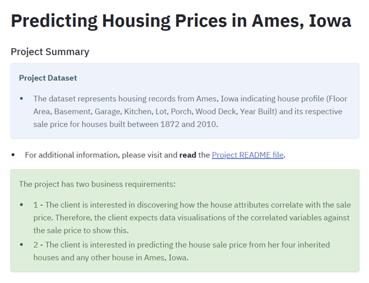

### Page 2 - House Sale Price Study

* Details business requirement 1
* Has a checkbox the user can click that will display the housing data
* Shows the variables most correlated to sale price
* Gives the conclusions that have been reached from the house sale price study
* Has a checkbox the user can click that will display graphs shows a scatterplot, for each variable, against sale price

House Sale Price Study Page Screenshots

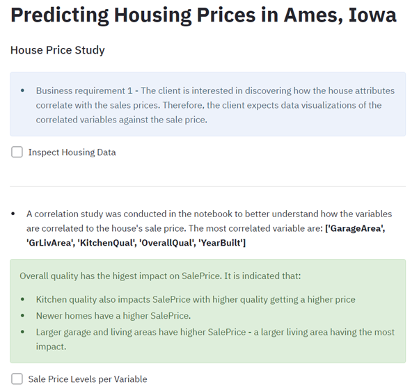

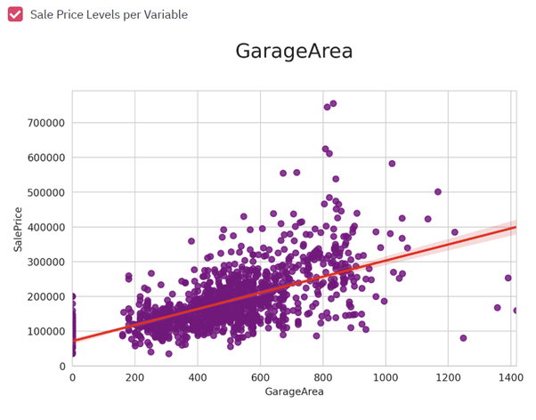

### Page 3 - Predict House Price

* Details business requirement 2
* Gives details of each of the variables shown and how to complete these
* Has 5 input sections where the client can enter the details, of the property, they would like to see the predicted price of
    * Above Grade/Ground Living Area:
        * The value must be greater than equal to zero. Although the minimum area in the dataset is 334 I chose to allow the user to input numbers greater or equal to zero as there could be the case of there being very little or no property above ground
        * The maximum value is set to 11,284 which is double the maximum of the highest value in the dataset
        * The default value is the median of the dataset values
    * Overall Quality:
        * The user can input an integer from 1 to 10, with 1 being 'very poor' and 5 being 'very excellent'
        * The default value is the median of the dataset values
     * Kitchen Quality:
        * The user can input an integer from 1 to 5, with 1 being 'poor' and 5 being 'excellent'
        * The default value is the median of the dataset values
    * Total Basement Area:
        * The minimum value is set to 0 as there could be no basement
        * The maximum value is set to 12,220 which is double the maximum of the highest value in the dataset
        * The default value is the median of the dataset values
    * Total Garage Area:
        * The minimum value is set to 0 as there could be no garage
        * The maximum value is set to 2,836 which is double the maximum of the highest value in the dataset
        * The default value is the median of the dataset values
* Has a button where the user can submit the details entered and will receive a sale price prediction based on these
* The next section is to show the predicted prices of the clients 4 inherited houses
* There is a checkbox where the client can see the data for these houses
* There is a button the client can press that will show the individual predicted sale price of these houses aswell as the summed price

Predict House Price Page Screenshots

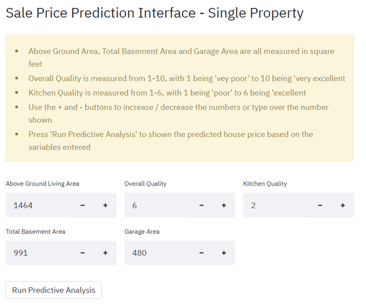
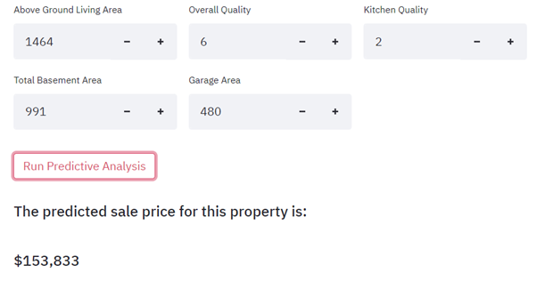
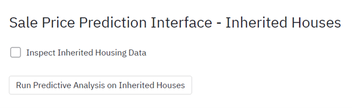
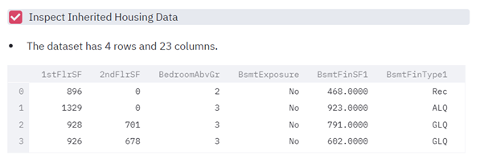
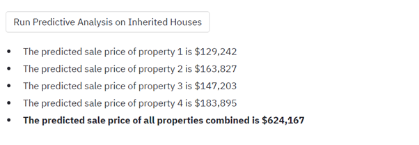

### Page 4 - Project Hypothesis and Valdation

* Details the initial hypothesis that were made and the consulsion to these based on the analysis

Project Hypothesis and Validation Page Screenshots

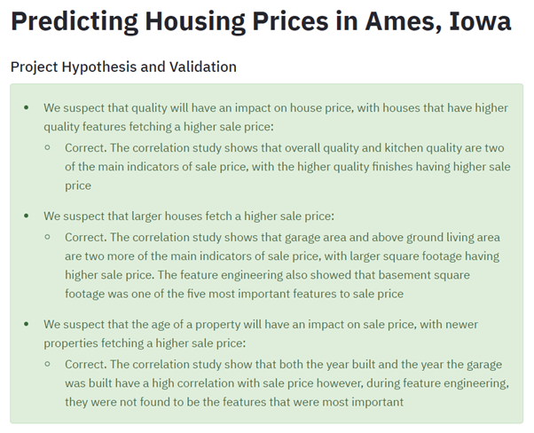

### Page 5 - ML Predict House Price

* Evalutes the ML pipline used
* Details the pipeline used
* Shows the features the model was trained on and there importance. This is shown as both a list and a bar chart
* Shows the pipeline performance

ML - Predict House Price Page Screenshots

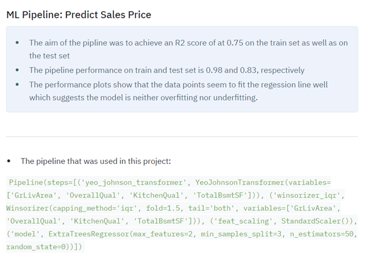

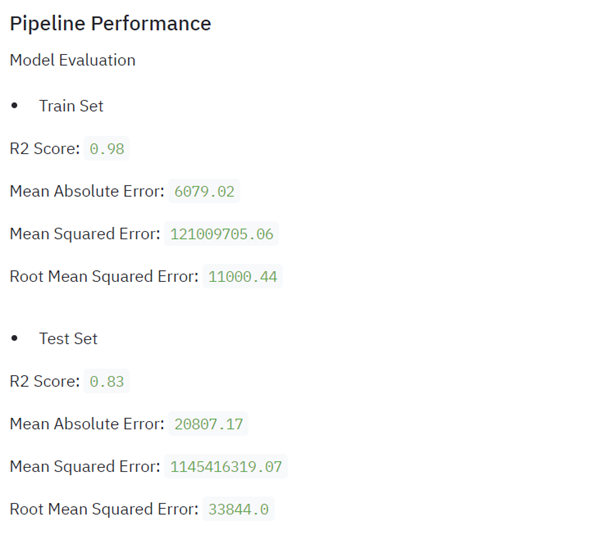

## Unfixed Bugs

There are no unfixed bugs that I'm aware of

## Deployment

### Heroku

* The App live link is: https://heritage-housing-739de1000c22.herokuapp.com/
* Set the runtime.txt Python version to a [Heroku-20](https://devcenter.heroku.com/articles/python-support#supported-runtimes) stack currently supported version.
* The project was deployed to Heroku using the following steps.

1. Log in to Heroku and create an App
2. At the Deploy tab, select GitHub as the deployment method.
3. Select your repository name and click Search. Once it is found, click Connect.
4. Select the branch you want to deploy, then click Deploy Branch.
5. The deployment process should happen smoothly if all deployment files are fully functional. Click the button Open App on the top of the page to access your App.
6. If the slug size is too large then add large files not required for the app to the .slugignore file.

## Main Data Analysis and Machine Learning Libraries

The technologies used for this project were:

### Frameworks and Programs Used

* CI Python Linter – To check code meets the required standard
* Codeanywhere – To write the code
* Github - To save and store files
* Heroku - To deploy the project
* Jupyter Notebooks - Contains the code to explore, clean, feature engineer and model the data 
* Kaggle - The dataset was downloaded from Kaggle
* Streamlit - Delivers the data app

### Libraries Used

* feature-engine==1.0.2 - 
* matplotlib==3.3.1
* numpy==1.18.5
* pandas==1.4.2
* pingouin==0.3.12
* plotly==4.12.0
* scikit-learn==0.24.2
* seaborn==0.11.0
* xgboost==1.2.1
* ydata-profiling==4.4.0

## Testing

### PEP8 Validation

I ran my code, for all python files, through the PEP8 validator. There were some formatting errors raised:

* E501 line too long (87 > 79 characters)
* E231 missing whitespace after '
* W293 blank line contains whitespace
* W292 no newline at end of file
* E302 expected 2 blank lines, found 1

These issues have now all been resolved and each page passes this validation

### Full Testing

### User Stories

## Credits 

* The code was based on the Code Institute Walkthough 2 - Churnometer project and adapted to fit the business requirements and data for this project
* I used the following websites to help with this project:
    * https://pandas.pydata.org
    * https://stackoverflow.com
    * https://www.geeksforgeeks.org
    * https://scikit-learn.org/
    * https://xgboost.readthedocs.io
    * https://towardsdatascience.com
    * https://feature-engine.trainindata.com
    * https://nbviewer.org/github/feature-engine/feature-engine-
    * https://jagan-singhh.medium.com

## Acknowledgements

I would like to thank:

* My mentor, Mo Shami, for his advice and guidance
* The Code Institute Slack community