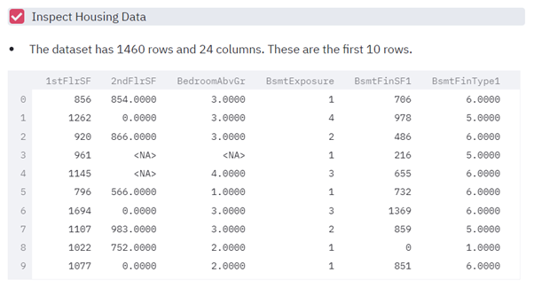
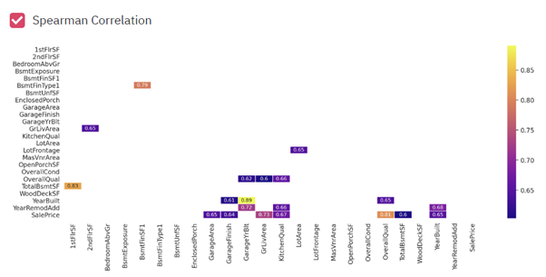
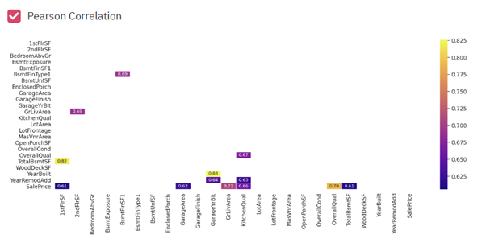
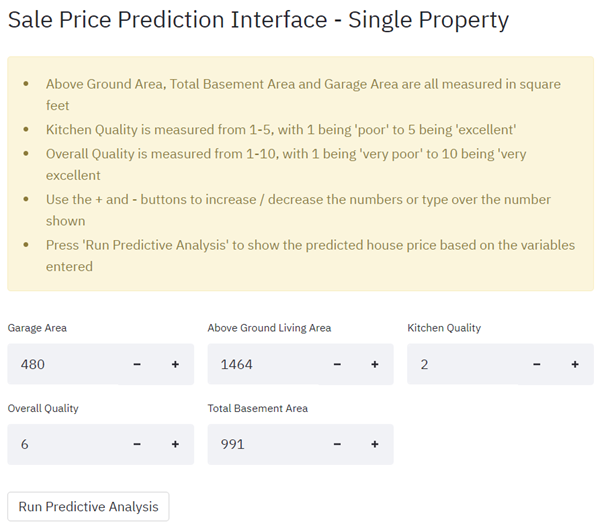
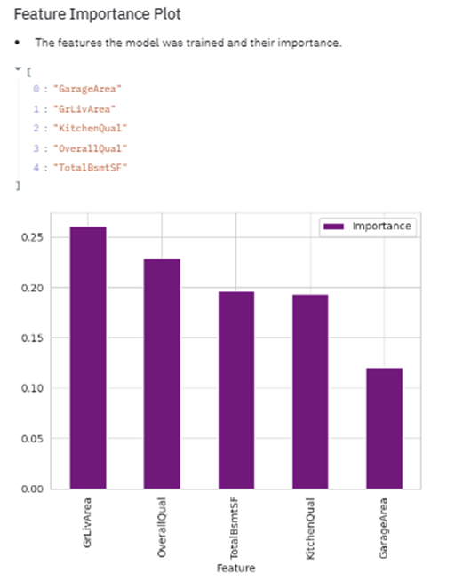
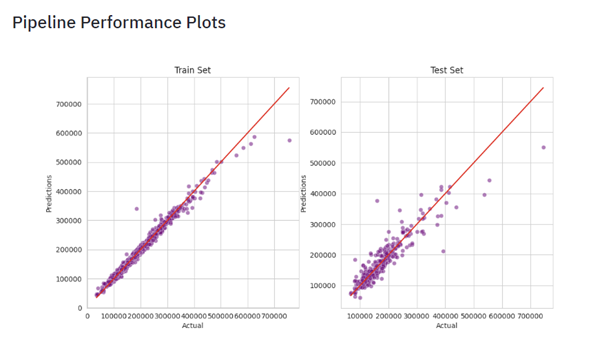

# Heritage Housing Sale Price Predictor

The heritage housing sale price predictor is an app to predict the sale price of houses in Ames, Iowa.
Further to this to app aims to predict the sale price of the four homes the client has inherited in Ames, Iowa

Visit the deployed site here: [Heritage Housing](https://heritage-housing-739de1000c22.herokuapp.com/)

## Contents

- [Heritage Housing Sale Price Predictor](#heritage-housing-sale-price-predictor)
* [Contents](#contents)
- [Dataset Content  ](#dataset-content)
- [Business Requirements](#business-requirements)
* [Hypothesis and how to validate?](#hypothesis-and-how-to-validate)
* [The rationale to map the business requirements to the Data Visualisations and ML tasks](#the-rationale-to-map-the-business-requirements-to-the-data-visualisations-and-ml-tasks)
- [ML Business Case](#ml-business-case)
* [Epics / User Stories](#epics-user-stories)
- [Dashboard Design](#dashboard-design)
* [Page 1 - Project Summary](#page-1-project-summary)
* [Page 2 - House Sale Price Study](#page-2-house-sale-price-study)
* [Page 3 - Predict House Price](#page-3-predict-house-price)
* [Page 4 - Project Hypothesis and Valdation](#page-4-project-hypothesis-and-valdation)
* [Page 5 - ML Predict House Price](#page-5-ml-predict-house-price)
- [Unfixed Bugs](#unfixed-bugs)
- [Deployment](#deployment)
* [Heroku](#heroku)
* [How to Fork](#how-to-fork)
* [How to Clone](#how-to-clone)
- [Main Data Analysis and Machine Learning Libraries](#main-data-analysis-and-machine-learning-libraries)
* [Frameworks and Programs Used](#frameworks-and-programs-used)
* [Libraries Used](#libraries-used)
- [Testing](#testing)
* [PEP8 Validation](#pep8-validation)
* [Full Testing](#full-testing)
    + [Project Summary Page](#project-summary-page)
    + [House Sale Price Study Page](#house-sale-price-study-page)
    + [Predict House Price Page](#predict-house-price-page)
    + [Project Hypothesis and Validation Page](#project-hypothesis-and-validation-page)
    + [ML - Predict House Price Page](#ml-predict-house-price-page)
* [User Stories](#user-stories)
    + [Epic 1 - Information gathering and data collection](#epic-1-information-gathering-and-data-collection)
    + [Epic 2 - Data visualization, cleaning, and preparation](#epic-2-data-visualization-cleaning-and-preparation)
    + [Epic 3 - Model training, optimization and validation](#epic-3-model-training-optimization-and-validation)
    + [Epic 4 - Dashboard planning, designing, and development](#epic-4-dashboard-planning-designing-and-development)
    + [Epic 5 - Dashboard deployment and release](#epic-5-dashboard-deployment-and-release)
- [Credits ](#credits)
- [Acknowledgements](#acknowledgements)

# Dataset Content  
* The dataset is sourced from [Kaggle](https://www.kaggle.com/codeinstitute/housing-prices-data). We then created a fictitious user story where predictive analytics can be applied in a real project in the workplace. 
* The dataset has almost 1.5 thousand rows and represents housing records from Ames, Iowa, indicating house profile (Floor Area, Basement, Garage, Kitchen, Lot, Porch, Wood Deck, Year Built) and its respective sale price for houses built between 1872 and 2010.

|Variable|Meaning|Units|
|:----|:----|:----|
|1stFlrSF|First Floor square feet|334 - 4692|
|2ndFlrSF|Second-floor square feet|0 - 2065|
|BedroomAbvGr|Bedrooms above grade (does NOT include basement bedrooms)|0 - 8|
|BsmtExposure|Refers to walkout or garden level walls|Gd: Good Exposure; Av: Average Exposure; Mn: Minimum Exposure; No: No Exposure; None: No Basement|
|BsmtFinType1|Rating of basement finished area|GLQ: Good Living Quarters; ALQ: Average Living Quarters; BLQ: Below Average Living Quarters; Rec: Average Rec Room; LwQ: Low Quality; Unf: Unfinshed; None: No Basement|
|BsmtFinSF1|Type 1 finished square feet|0 - 5644|
|BsmtUnfSF|Unfinished square feet of basement area|0 - 2336|
|TotalBsmtSF|Total square feet of basement area|0 - 6110|
|GarageArea|Size of garage in square feet|0 - 1418|
|GarageFinish|Interior finish of the garage|Fin: Finished; RFn: Rough Finished; Unf: Unfinished; None: No Garage|
|GarageYrBlt|Year garage was built|1900 - 2010|
|GrLivArea|Above grade (ground) living area square feet|334 - 5642|
|KitchenQual|Kitchen quality|Ex: Excellent; Gd: Good; TA: Typical/Average; Fa: Fair; Po: Poor|
|LotArea| Lot size in square feet|1300 - 215245|
|LotFrontage| Linear feet of street connected to property|21 - 313|
|MasVnrArea|Masonry veneer area in square feet|0 - 1600|
|EnclosedPorch|Enclosed porch area in square feet|0 - 286|
|OpenPorchSF|Open porch area in square feet|0 - 547|
|OverallCond|Rates the overall condition of the house|10: Very Excellent; 9: Excellent; 8: Very Good; 7: Good; 6: Above Average; 5: Average; 4: Below Average; 3: Fair; 2: Poor; 1: Very Poor|
|OverallQual|Rates the overall material and finish of the house|10: Very Excellent; 9: Excellent; 8: Very Good; 7: Good; 6: Above Average; 5: Average; 4: Below Average; 3: Fair; 2: Poor; 1: Very Poor|
|WoodDeckSF|Wood deck area in square feet|0 - 736|
|YearBuilt|Original construction date|1872 - 2010|
|YearRemodAdd|Remodel date (same as construction date if no remodelling or additions)|1950 - 2010|
|SalePrice|Sale Price|34900 - 755000|

# Business Requirements
As a good friend, you are requested by your friend, who has received an inheritance from a deceased great-grandfather located in Ames, Iowa, to  help in maximising the sales price for the inherited properties.

Although your friend has an excellent understanding of property prices in her own state and residential area, she fears that basing her estimates for property worth on her current knowledge might lead to inaccurate appraisals. What makes a house desirable and valuable where she comes from might not be the same in Ames, Iowa. She found a public dataset with house prices for Ames, Iowa, and will provide you with that.

* Business Requirement 1 - The client is interested in discovering how the house attributes correlate with the sale price. Therefore, the client expects data visualisations of the correlated variables against the sale price to show that.
* Business Requirement 2 - The client is interested in predicting the house sale price from her four inherited houses and any other house in Ames, Iowa.

## Hypothesis and how to validate?
* We suspect that quality will have an impact on house price, with houses that have higher quality features fetching a higher sale price.
    * This will be determined though a correlation study
    * Correct. The correlation study shows that overall quality and kitchen quality are two of the main indicators of sale price, with the higher quality finishes having higher sale price
* We suspect that larger houses fetch a higher sale price.
    * This will be determined though a correlation study
    * Correct. The correlation study shows that garage area and above ground living area are two more of the main indicators of sale price, with larger square footage having higher sale price. The feature engineering also showed that basement square footage was one of the five most important features to sale price
* We suspect that the age of a property will have an impact on sale price, with newer properties fetching a higher sale price.
    * This will be determined though a correlation study
    * Correct. The correlation study show that both the year built and the year the garage was built have a high correlation with sale price however, during feature engineering, they were not found to be the features that were most important

## The rationale to map the business requirements to the Data Visualisations and ML tasks

* Business requirement 1 - The client is interested in discovering how the house attributes correlate with the sale price. Therefore, the client expects data visualisations of the correlated variables against the sale price to show that.
    * The data used will be downloaded from [Kaggle](https://www.kaggle.com/datasets/codeinstitute/housing-prices-data) 
    * I will use conventional data analysis used to investigate how house attributes are correlated with the sale prices
    * Correlation and PPS study to be completed - Spearman, Pearson and Predictive Power Score (PPS). There will be a visual representation of these using heatmaps
    * A scatterplot to be used to visulise the impact of the most correlated variables agains sale price
* Business requirement 2 - The client is interested in predicting the house sale price from her four inherited houses and any other house in Ames, Iowa.
    * The data suggests a regressor where the target is the sale price
    * I will use feature engineering to compare transfomations 
    * I will build a pipeline based on the best transformations and most important features
    * It was agreed with the client an R2 score of at least 0.75 on the train set as well as on the test set is achieved
    * A dashboard will be produced using Streamlit==0.85
    * The dashboard will be deployed using Heroku

# ML Business Case

* The aim is to build a machine learning model that can meet the business requirements
* The sucess / failure of the model will be based on achieving an R2 score of at least 0.75 on both the train and test sets, there being limited discrepancies between the achieved sale price values and the predicted values and a model that does not overfit or underfit
* The model will be trained using the kaggle data. The will be split into 80% of the data being used for the train set and 20% for the test set

## Epics / User Stories

* Epic 1 - Information gathering and data collection
    * As a data analyst I want to source a dataset of accurate data so that I have high quality data on which to build my predictions 
* Epic 2 - Data visualization, cleaning, and preparation
    * As a data analysist I want to clean the dataset used so there are fewer errors and the predictions I make are more accurate
    * As a client I want to see graphs to show which variables have the most impact on sale price
    * As a client I want to see heatmaps to show which variables are most correlated with sale price 
* Epic 3 - Model training, optimization and validation
    * As a data analyst I want to find the pipeline that delivers the best results so that my predictions have more accuracy
    * As a data analyst I want to achieve an R2 score of at least 0.75 to meet the business expectation
* Epic 4 - Dashboard planning, designing, and development
    * As a client I want to have a simple interface so I can quickly find the predicted value of a property
    * As a client I want to be able to see the individual predicted prices of my 4 inherited properties, as well as the summed price, so I can easily access this information 
* Epic 5 - Dashboard deployment and release
    * As a data analyst I was my app to be deployed so that my client can easily access this
    * As I client I want to be able to access the deployed app so I can run the predictions for the houses I would like to know the predicted price/s of

# Dashboard Design

## Page 1 - Project Summary

* A summary of the project dataset
* A link to the ReadMe file
* Sets out the business requirements

Project Summary Page Screenshots

## Page 2 - House Sale Price Study

* Details business requirement 1
* Has a checkbox the user can click that will display the housing data
* Shows the variables most correlated to sale price
* Gives the conclusions that have been reached from the house sale price study
* Has a checkbox the user can click that will display graphs shows a scatterplot, for each variable, against sale price
* Has a checkbox the user can click that will display the Spearman correlation heatmap
* Has a checkbox the user can click that will display the Pearson correlation heatmap

House Sale Price Study Page Screenshots

## Page 3 - Predict House Price

* Details business requirement 2
* Gives details of each of the variables shown and how to complete these
* Has 5 input sections where the client can enter the details, of the property, they would like to see the predicted price of
    * Above Grade/Ground Living Area:
        * The value must be greater than equal to zero. Although the minimum area in the dataset is 334 I chose to allow the user to input numbers greater or equal to zero as there could be the case of there being very little or no property above ground
        * The maximum value is set to 11,284 which is double the maximum of the highest value in the dataset
        * The default value is the median of the dataset values
    * Overall Quality:
        * The user can input an integer from 1 to 10, with 1 being 'very poor' and 5 being 'very excellent'
        * The default value is the median of the dataset values
    * Kitchen Quality:
        * The user can input an integer from 1 to 5, with 1 being 'poor' and 5 being 'excellent'
        * The default value is the median of the dataset values
    * Total Basement Area:
        * The minimum value is set to 0 as there could be no basement
        * The maximum value is set to 12,220 which is double the maximum of the highest value in the dataset
        * The default value is the median of the dataset values
    * Total Garage Area:
        * The minimum value is set to 0 as there could be no garage
        * The maximum value is set to 2,836 which is double the maximum of the highest value in the dataset
        * The default value is the median of the dataset values
* Has a button where the user can submit the details entered and will receive a sale price prediction based on these
* The next section is to show the predicted prices of the clients 4 inherited houses
* There is a checkbox where the client can see the data for these houses
* There is a button the client can press that will show the individual predicted sale price of these houses aswell as the summed price

Predict House Price Page Screenshots

## Page 4 - Project Hypothesis and Valdation

* Details the initial hypothesis that were made and the consulsion to these based on the analysis

Project Hypothesis and Validation Page Screenshots

## Page 5 - ML Predict House Price

* Evalutes the ML pipline used
* Details the pipeline used
* Shows the features the model was trained on and there importance. This is shown as both a list and a bar chart
* Shows the pipeline performance

ML - Predict House Price Page Screenshots

# Unfixed Bugs

There are no unfixed bugs that I'm aware of

# Deployment

## Heroku

* The App live link is: https://heritage-housing-739de1000c22.herokuapp.com/
* Set the runtime.txt Python version to a [Heroku-20](https://devcenter.heroku.com/articles/python-support#supported-runtimes) stack currently supported version.
* The project was deployed to Heroku using the following steps.

This site is deployed using Heroku and following these steps:
1.	Create a Heroku account or, if you already have one, log in
2.	Click the 'new' button and select 'create new app'
3.	Enter a unique name for your app and choose the region you are in
4.	Click 'create app'
5.	Navigate to the top of the page and click 'Deploy'
6.	Scroll to the deployment method and choose Github
7.	In the next section, Connect to Github, type in your repository name. If you press the search button it'll bring up all your repositories. Connect to the correct repository
8.	Scroll down to the two sections for deployment (automatic deploys or manual deploys). The automatic deplays will update each time the 'git push' command is entered. For the maunal deploy, this will deploy the branch specified, in it's current state, when the 'Deploy Branch' button is clicked

## How to Fork

- Sign up and login to GitHub
- Find the GitHub repository https://github.com/Gkicks/milestone-project-heritage-housing-issues.git 
- Locate the “fork” button which is located towards the top of the page. Click this button

## How to Clone

- Sign up and login to GitHub
- Find the GitHub repository https://github.com/Gkicks/milestone-project-heritage-housing-issues.git 
- Locate the “<> Code” button and click this. This will bring up a new panel
- Click the local tab
- Decide if you would like to clone with HTTPS, SSH or GitHub CLI – copy the link shown under the one of your choosing
- Open your code editor
- Open a new terminal in your code editor and change the working directory to the location you want to use for the clone directory (you can use the cd command to change directories)
- When you are in your chosen directory type “git clone” followed by pasting in the URL you copied in GitHub
- Press enter to execute the command and your clone will be created

# Main Data Analysis and Machine Learning Libraries

The technologies used for this project were:

## Frameworks and Programs Used

* CI Python Linter – To check code meets the required standard
* Codeanywhere – To write the code
* Github - To save and store files
* Heroku - To deploy the project
* Jupyter Notebooks - Contains the code to explore, clean, feature engineer and model the data 
* Kaggle - The dataset was downloaded from Kaggle
* Streamlit - Delivers the data app

## Libraries Used

* feature-engine==1.0.2 - 
* matplotlib==3.3.1
* numpy==1.18.5
* pandas==1.4.2
* pingouin==0.3.12
* plotly==4.12.0
* scikit-learn==0.24.2
* seaborn==0.11.0
* xgboost==1.2.1
* ydata-profiling==4.4.0

# Testing

## PEP8 Validation

I ran my code, for all python files, through the PEP8 validator. I used the  pycodestyle package to validate the code written in the Jupyter notebooks. There were some formatting errors raised:

* E501 line too long (87 > 79 characters)
* E231 missing whitespace after '
* W293 blank line contains whitespace
* W292 no newline at end of file
* W391 blank line at end of file (in Jupyter notebooks)
* E302 expected 2 blank lines, found 1

These issues have now all been resolved and each page passes this validation

## Full Testing

### Project Summary Page

**Action**|**Expected Result**|**As Expected?**
:-----:|:-----:|:-----:
Click Project Summary radio button|Takes user to Project Summary page|Yes
Click ReadMe link|Takes user to ReadMe in Github|Yes

### House Sale Price Study Page

**Action**|**Expected Result**|**As Expected?**
:-----:|:-----:|:-----:
Click House Sale Price Study radio button|Takes user to House Sale Price Study page|Yes
Click Inspect Housing Data checkbox|Displays the dataframe of housing data|Yes
Click Sale Price Levels per Variable checkbox|Displays scatterplots of sale price against different variables|Yes

### Predict House Price Page

**Action**|**Expected Result**|**As Expected?**
:-----:|:-----:|:-----:
Click Predict House Price radio button|Takes user to Predict House Price Page|Yes
Enter negative number in Above Ground Living Area input|An error to be displayed that the value must be greater or equal to 0|Yes
Enter number greater than 11,284 in Above Ground Living Area input|An error to be displayed that the value must be less than or equal to 11,284|Yes
Press the + button in Above Ground Living Area input|The integer input to increase by 1|Yes
Press the + button in Above Ground Living Area input when the integer reaches 1|For this to be disabled|Yes
Press the - button in Above Ground Living Area input|The integer input to decrease by 1|Yes
Press the - button in Above Ground Living Area input when the integer reaches 11,284|For this to be disabled|Yes
Enter number less than 1 in Overall Quality input|An error to be displayed that the value must be greater or equal to 1|Yes
Enter number greater than 10 in Overall Quality input|An error to be displayed that the value must be less than or equal to 10|Yes
Press the + button in Overall Quality input|The integer input to increase by 1|Yes
Press the + button in Overall Quality input when the integer reaches 1|For this to be disabled|Yes
Press the - button in Overall Quality input|The integer input to decrease by 1|Yes
Press the - button in Overall Quality input when the integer reaches 10|For this to be disabled|Yes
Enter number less than 1 in Kitchen Quality input|An error to be displayed that the value must be greater or equal to 1|Yes
Enter number greater than 6 in Kitchen Quality input|An error to be displayed that the value must be less than or equal to 6|Yes
Press the + button in Overall Kitchen input|The integer input to increase by 1|Yes
Press the + button in Overall Kitchen input when the integer reaches 1|For this to be disabled|Yes
Press the - button in Overall Kitchen input|The integer input to decrease by 1|Yes
Press the - button in Overall Kitchen input when the integer reaches 6|For this to be disabled|Yes
Enter negative number in Total Basement Area input|An error to be displayed that the value must be greater or equal to 0|Yes
Enter number greater than 12,220 in Total Basement Area input|An error to be displayed that the value must be less than or equal to 11,284|Yes
Press the + button in Total Basement Area input|The integer input to increase by 1|Yes
Press the + button in Total Basement Area input when the integer reaches 1|For this to be disabled|Yes
Press the - button in Total Basement Area input|The integer input to decrease by 1|Yes
Press the - button in Total Basement Area input when the integer reaches 12,220|For this to be disabled|Yes
Enter negative number in Garage Area input|An error to be displayed that the value must be greater or equal to 0|Yes
Enter number greater than 2,836 in Garage Area input|An error to be displayed that the value must be less than or equal to 11,284|Yes
Press the + button in Garage Area input|The integer input to increase by 1|Yes
Press the + button in Garage Area input when the integer reaches 1|For this to be disabled|Yes
Press the - button in Total Garage Area input|The integer input to decrease by 1|Yes
Press the - button in Total Garage Area input when the integer reaches 2,836|For this to be disabled|Yes
Press the Run Predictive Analysis button when all valid numbers are inputted|The predicted price of the property to be displayed|Yes
Click Inspect Inherited Housing Data checkbox|Displays the dataframe of inherited housing data|Yes
Press the Run Predictive Analysis on inherited Houses button|Displays the individual sale price prediction for the individual houses aswell as the summed price|Yes

### Project Hypothesis and Validation Page

**Action**|**Expected Result**|**As Expected?**
:-----:|:-----:|:-----:
Click Hypothesis and Validation radio button|Takes user to Hypothesis and Validation page|Yes

### ML - Predict House Price Page

**Action**|**Expected Result**|**As Expected?**
:-----:|:-----:|:-----:
Click ML - Predict House Price radio button|Takes user toProject Hypothesis and Validation Page page|Yes

## User Stories

### Epic 1 - Information gathering and data collection

**User Story**|**How This Has Been Met**
:-----:|:-----:
As a data analyst I want to source a dataset of accurate data so that I have high quality data on which to build my predictions|The data was taken from Kaggle and is thought to be an accurate representation of the house prices in Ames, Iowa

### Epic 2 - Data visualization, cleaning, and preparation

**User Story**|**How This Has Been Met**
:-----:|:-----:
As a data analysist I want to clean the dataset used so there are fewer errors and the predictions I make are more accurate|Two of the variables were dropped due to having a high percentage of missing values - EnclosedPorch (90.7%) and WoodDeckSF (89.4%). Decisions were based on the values to input for the other missing data following analysis
As a client I want to see graphs to show which variables have the most impact on sale price|The user can see scattergraphs showing sale price plotted against each of the most correlated variable. These are shown when the user clicks the Sale Price Level per Variable in the House Sale Price Study page
AS a client I want to see heatmaps to show which variables are most correlated with sale price|Both Pearson and Spearman correlations were run. Heatmaps for each of these are displayed on the dashboard when the user clicks the relevant checkbox

### Epic 3 - Model training, optimization and validation

**User Story**|**How This Has Been Met**
:-----:|:-----:
As a data analyst I want to find the pipeline that delivers the best results so that my predictions have more accuracy|Transformers were used in the feature engineering stage - numerical transformation, handling of outliers using Windsorizer and smart correlation selection. The transformations were compared and the best performing transformer used on each variable that had high correlation. This was combined with the data cleaning steps to form the pipeline. Hyperparmeter Optimization was then carried out to find the best hyperperameter configeration - ExtraTreesRegressor was the best performing of these
As a data analyst I want to achieve an R2 score of at least 0.75 to meet the business expectation|Following the pipeline being fit with the best features, the pipeline performance on the train and test set is 0.98 and 0.83, respectively

### Epic 4 - Dashboard planning, designing, and development

**User Story**|**How This Has Been Met**
:-----:|:-----:
As a client I want to have a simple interface so I can quickly find the predicted value of a property|The dashboard is simple to use and intuitive
As a client I want to be able to see the individual predicted prices of my 4 inherited properties, as well as the summed price, so I can easily access this information|These are both shown on the dashboard. The client is able to iput different configerations, of the features improtance variables, to find how these affect sale price

### Epic 5 - Dashboard deployment and release

**User Story**|**How This Has Been Met**
:-----:|:-----:
As a data analyst I was my app to be deployed so that my client can easily access this|The app has been deployed through Heroku
As I client I want to be able to access the deployed app so I can run the predictions for the houses I would like to know the predicted price/s of|The client is able to access the app using the Heroku link shown in this ReadMe

# Credits 

* The code was based on the Code Institute Walkthough 2 - Churnometer project and adapted to fit the business requirements and data for this project
* I used the following websites to help with this project:
    * https://pandas.pydata.org
    * https://stackoverflow.com
    * https://www.geeksforgeeks.org
    * https://scikit-learn.org/
    * https://xgboost.readthedocs.io
    * https://towardsdatascience.com
    * https://feature-engine.trainindata.com
    * https://nbviewer.org/github/feature-engine/feature-engine-
    * https://jagan-singhh.medium.com

# Acknowledgements

I would like to thank:

* My mentor, Mo Shami, for his advice and guidance
* The Code Institute Slack community